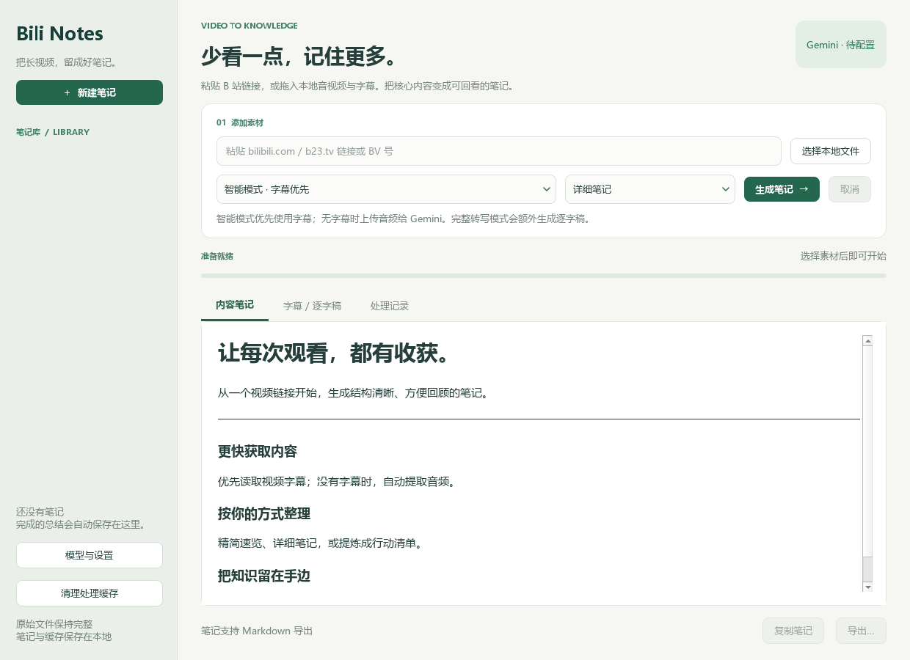

# Bili Notes · B 站视频笔记

把 B 站视频、本地音视频和字幕整理成可回看的中文笔记。Python + PySide6 桌面应用，使用官方 Google Gen AI SDK。



本轮测试结果与真实联网限制见 [验证记录](VALIDATION.md)。

## 快速启动

需要 **Python 3.11–3.13（64 位，建议 3.12）**。在项目目录打开终端：

```powershell
py -3.12 -m venv .venv
.\.venv\Scripts\python.exe -m pip install -r requirements.txt
.\.venv\Scripts\python.exe main.py
```

安装完成后，Windows 可双击 `启动.bat`。首次安装需联网。FFmpeg 默认从 PATH 查找，否则使用 `imageio-ffmpeg` wheel 中的可执行文件，无需另外配置；也可在设置中指定。

macOS / Linux：

```bash
python3 -m venv .venv
.venv/bin/python -m pip install -r requirements.txt
.venv/bin/python main.py
```

Linux 需要可用的桌面显示服务及 Qt 系统库。以上跨平台入口已提供，当前实际验证环境为 Windows。

## Gemini 配置

1. 前往 [Google AI Studio](https://aistudio.google.com/apikey) 创建 API Key。
2. 打开应用「模型与设置」，填写密钥。默认仅在本次会话使用；勾选记住后存入系统凭据库（Windows Credential Manager / macOS Keychain / Linux Secret Service 或 KWallet）。凭据库不可用时会提示，不降级为明文文件。
3. 默认使用稳定版 **`gemini-3.1-flash-lite`**。可手动输入其他模型 ID，或点击「验证连接并刷新模型列表」。列表表示项目可见且支持生成的模型，不保证每个模型都支持音频或有可用额度。
4. 也支持 `GEMINI_API_KEY` 环境变量。优先级为本次会话输入 > 环境变量 > 系统凭据库。

**Google AI Pro 消费者订阅与 Gemini Developer API 分别管理。** 不要把订阅的聊天额度当作 API 额度；免费层、速率限制、计费及任何可兑换权益，以你的 AI Studio / Cloud 项目显示为准。应用不自动开通付费或切换到更昂贵的模型。

旧版 `~/.bili_summarizer/api_key.txt` 实际保存的是明文，新版不会读取、迁移或删除它；请手动重新填写密钥。确认新版可用后，可自行处理旧凭据文件。

## 使用方式

- 粘贴单视频链接、分享文本中的链接、`b23.tv` 短链接或 `BV` 号；`?p=2` 等分 P 参数保留。暂不支持直播、番剧、合集批处理或个人空间。
- 拖入或选择 `.mp3 .m4a .m4s .wav .aac .flac .ogg .mp4 .mkv .webm .mov` 等音视频，或 `.txt .srt .vtt .json .json3` 字幕。
- 字幕 JSON 支持 B 站 `body` 格式和 JSON3 `events` 格式；本地文本需 UTF-8。
- 选择笔记风格：精简速览、详细笔记、行动清单。
- 完成的结果自动保存到侧边栏；可复制 Markdown、导出 `.md` 笔记或 `.txt` 逐字稿。

| 模式 | 处理流程 | 适用场景 |
| --- | --- | --- |
| 兼容模式（默认） | 单次解析并下载音频 → 分段笔记 → 汇总 | B 站链接，减少额外接口请求 |
| 直接听音频 | 下载 / 提取音频 → 分段笔记 → 汇总 | 不需要逐字稿，字幕质量较差 |
| 完整转写 | 下载 / 提取音频 → 分段完整转写 → 文字总结 | 需要保留原文、核对内容 |

远程链接沿用旧版的单次音频下载方法，不预查在线字幕。本地字幕文件在所有模式下直接按文字处理。直接音频总结不会伪装成逐字稿。转写由 Gemini 在云端完成，当前未集成本地 Whisper。音频理解不读取视频画面，无法还原未被口述的图表或字幕信息。

## 下载、长视频和失败恢复

- 使用维护中的 `yt-dlp`，优先下载音频流，只有没有独立音轨时才回退到含视频的媒体。
- 每个任务拥有独立临时目录，使用下载器明确返回的文件路径，不扫描工作目录猜测“最新 MP3”。
- 登录受限视频可在设置里选择 Netscape 格式 Cookie 文件；应用只使用它的临时副本，不修改原 Cookie 文件，不主动读取浏览器 Cookie。
- 默认转换为 **16 kHz / 单声道 / 48 kbps MP3**，每段 480 秒；可设为 60–900 秒。无需把非 MP3 文件仅改扩展名上传。
- 分段模型结果按内容、提示词版本、模型和处理要求生成缓存键；再次处理相同素材会复用完成结果。更改模型或相关提示词会产生新缓存。
- 重试仍可能重新下载、转码；这是模型结果恢复，**不是断点续传下载**。直接总结与完整转写的缓存不同。
- 长文字先分别提取笔记，再分层合并；检测空输出、截断和无法收敛的结果，不标记为成功。
- 429 / 临时 5xx 最多尝试 3 次；401 / 403 等不反复重试。SDK 请求超时为 120 秒。请求在途时取消需等待其返回 / 超时，之后清理资源；FFmpeg 可直接终止。上传可能包含多个 HTTP 请求，因此这不是整个任务的总时限。
- 云端音频处理状态会轮询，已取得 ID 的临时文件会在成功、失败或取消后尝试删除。删除失败会在处理记录中提示；上传结果不明、断电或强制杀进程时，不能保证即时清理，可检查 Files API 文件列表。
- 原始媒体只读。清理缓存按钮只删除应用的模型结果缓存，不删除源文件或历史笔记。

B 站风控 / 412、登录权限、地区与网络状态仍可能影响提取。下载失败时先确认视频在浏览器能播放并稍后重试。恢复本项目验证版本可执行：

```powershell
python -m pip install -r requirements.txt
```

代理沿用标准环境变量，例如 `HTTPS_PROXY`；界面不保存代理密码。

## 数据和隐私

默认数据在项目 `data/` 下，可用 `BILI_NOTES_DATA` 指向其他目录（例如已安装到只读目录时）：

```text
data/
  settings.json   模型、Cookie 路径、FFmpeg 路径、分段长度，不含 API Key
  history/        完整笔记及字幕 / 转写
  cache/          已完成模型输出，用于重复使用和失败恢复
  temp/           运行中任务的下载、转码与 Cookie 副本
```

字幕、音频片段及分段笔记会按模式发送给 Google Gemini。历史和缓存是本地明文内容，不是加密档案。正常退出会清理当前任务临时目录；异常断电产生的遗留 `data/temp/job-*` 目录可在关闭应用后手动清理。

界面渲染 Markdown 时禁用 HTML 和嵌入图片资源，只允许用户点击打开 HTTP(S) 链接。视频中的命令性文本会作为待分析内容放入模型输入，并由系统提示明确限定其角色。

## 工程结构与验证

```text
main.py                    桌面启动入口
bili_notes/core.py         数据类型、字幕解析、URL 校验、本地存储、取消令牌
bili_notes/media.py        yt-dlp 下载 / 字幕、FFmpeg 转码分段
bili_notes/gemini.py       官方 SDK、重试、缓存、云端文件生命周期
bili_notes/pipeline.py     单次下载、转写、分段与分层总结
bili_notes/credentials.py  会话密钥与系统凭据库
bili_notes/ui.py           Qt 界面与线程信号
```

```powershell
.\.venv\Scripts\python.exe -m pip install -e ".[dev]"
.\.venv\Scripts\python.exe -m pytest -q
.\.venv\Scripts\python.exe -m ruff check .
```

测试使用假 API 响应，覆盖取消、重试、缓存、原始文件保护、B 站单次下载、长文本分块、云端文件清理、真实 FFmpeg 转码和 Qt 界面交互。测试不会调用付费模型，也不会读取个人 Cookie 或真实密钥。测试通过不等于已完成真实 B 站 + Gemini 端到端验证。

## 官方参考

- [Gemini 3.1 Flash-Lite 模型与音频支持](https://ai.google.dev/gemini-api/docs/models/gemini-3.1-flash-lite)
- [Gemini API 计费](https://ai.google.dev/gemini-api/docs/billing)
- [Gemini 音频理解](https://ai.google.dev/gemini-api/docs/audio)
- [Google Gen AI Python SDK](https://googleapis.github.io/python-genai/)
- [yt-dlp 嵌入用法](https://github.com/yt-dlp/yt-dlp#embedding-yt-dlp)
- [Qt for Python](https://doc.qt.io/qtforpython-6/)

保留原项目 Apache-2.0 许可证。第三方依赖各自遵循其许可证；若制作分发安装包，应随包保留 Qt、FFmpeg 等组件要求的许可信息。
